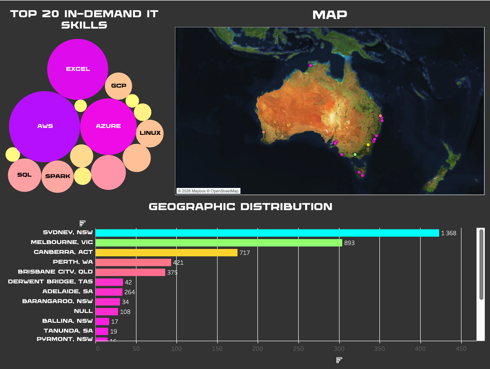
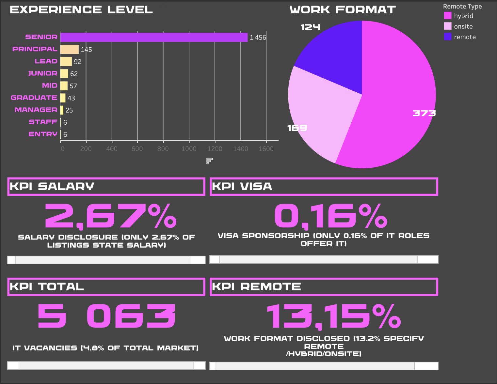
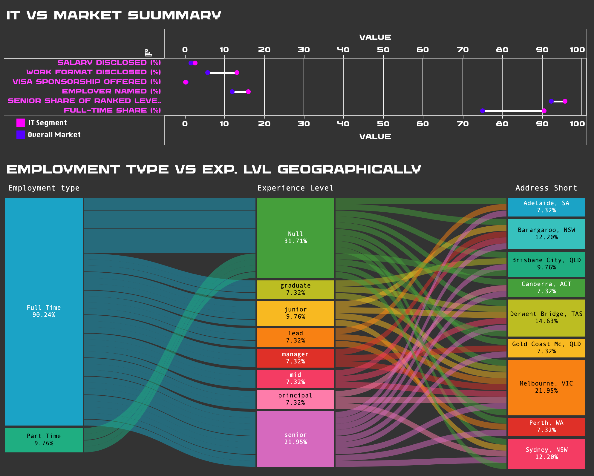

# Project Summary — Australian IT Labour Market Intelligence Platform

This document summarises the key findings, dashboards, and limitations of
the project. For the full project description and goals, see the main
[README](../README.md). For detailed analytical write-ups behind each
finding, see the other files in this [reports/](.) folder.

**Dataset:** 105,337 Australian job advertisements (5,063 in the IT-specific
subset)

**Workbook:** [visualizations/Australian_IT_dashboard.twbx](../visualizations/Australian_IT_dashboard.twbx)
*(open with Tableau Desktop or the free Tableau Reader)*

---

## Key Findings

**1. IT is more salary-transparent than the market, but still opaque overall**
Only 2.67% of IT listings disclose salary, compared to 1.55% market-wide.
IT is nearly twice as transparent, but absolute disclosure remains very low.

**2. The market is heavily senior-skewed, and IT even more so**
Senior listings outnumber junior almost 23:1 in IT, versus roughly 12:1
market-wide. Junior and entry-level roles combined make up just 1.3% of
IT listings — a limited entry point for early-career candidates.

**3. Canberra is a hidden IT hub**
Canberra jumps from 6th place in the overall market to 3rd in the IT
segment, plausibly driven by government IT contracts and consulting work
concentrated in the capital.

**4. Visa sponsorship is counterintuitively lower in IT**
Only 0.16% of IT listings mention visa sponsorship, versus 0.4% market-wide.
This runs against the common assumption that tech roles are more open to
international candidates.

**5. Full-time dominates IT hiring, and part-time listings rarely specify seniority**
90.5% of IT listings are full-time. Part-time roles almost never include
an explicit seniority level, unlike full-time listings, which are broken
down clearly across Graduate through Senior.

For the full findings log with queries and detailed reasoning, see
[key_findings.md](key_findings.md) and [eda_findings.md](eda_findings.md).

---

## Dashboards

### Dashboard 1 — Skills & Geography

Top 20 in-demand IT skills, geographic distribution across Australian
cities, and an interactive map of vacancy locations.

### Dashboard 2 — Experience & Work Format

Experience level breakdown, work format split (remote/hybrid/onsite), and
key market KPIs (salary disclosure, visa sponsorship, total vacancies).

### Dashboard 3 — IT vs. Market Summary

Dumbbell comparison of IT segment vs. overall market across six metrics,
plus a Sankey flow of Employment Type → Experience Level → City.

---

## Data Sources

- Adzuna (job listings API)
- Workforce Australia
- Jooble

## How the IT subset was built

A listing is included in the IT-specific subset if it either:
- has at least one detected technical skill (via keyword extraction), or
- its title matches a narrowed set of IT-specific role patterns
  (e.g. "software engineer", "data analyst", "devops engineer")

Broad terms like bare "engineer" or "architect" were intentionally excluded,
since an early version of the filter pulled in non-IT roles such as
Mechanical Engineer and Civil Engineer. See
[IT_segment_vs_Overall_market.md](IT_segment_vs_Overall_market.md) for the
full comparison methodology.

---

## Limitations

- **Salary data is thin.** Only 1.55% of listings market-wide (2.67% in IT)
  disclose salary — mostly from Adzuna and Jooble, which make up under 1.5%
  of the dataset. Salary-based conclusions should be treated as directional.
- **Employer names are largely missing.** 84-88% of listings list "not
  specified" as the employer — a "top employers" view reflects visible
  agencies more than the real hiring market.
- **Most listings lack an explicit experience level or work format** —
  around 30% and 87% respectively for the IT subset — so these breakdowns
  describe the listings that do specify, not the full market.
- **Source imbalance.** The primary source (Workforce Australia) covers all
  industries, not just IT, so the IT subset relies on skill/title-based
  filtering rather than a dedicated IT-only source.

---

## Author

**Alena Vorobei**
Data Analytics Portfolio Project
